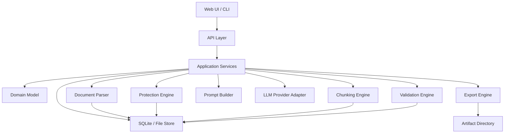
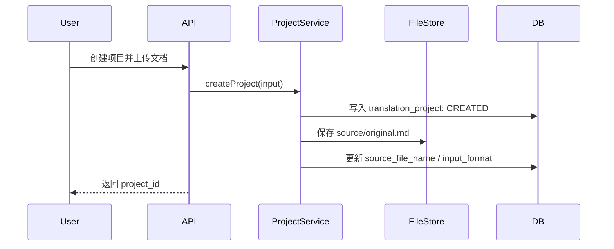

# 长文档结构化翻译工作流 V1.0 技术设计

## 1. 文档目的

本文档基于 [PRD-V1.0.md](PRD-V1.0.md) 细化 V1.0 的技术设计，目标是把产品需求落到可实现、可测试、可迭代的系统方案中。

V1.0 的核心不是“把整篇文档一次性丢给模型”，而是搭建一条可恢复、可追踪、可校验的长文档翻译流水线：

```text
导入文档 -> 解析结构 -> 保护不可翻译内容 -> 结构化切片 -> 分块翻译
       -> 质量校验 -> 占位符恢复 -> 状态持久化 -> 导出交付物
```

## 2. 设计范围

### 2.1 V1.0 必须覆盖

1. Markdown 文档导入、解析、切片、翻译、校验、导出闭环。
2. TXT / DOCX 预留解析适配层，V1.0 可做基础支持或延后到 P1。
3. 项目级状态管理与 chunk 级状态管理。
4. 术语表、风格指南、保护规则的版本化引用。
5. 不可翻译内容保护与恢复。
6. 失败续跑、指定失败 chunk 重试、指定章节重翻。
7. Markdown 译文版、原文译文对照版、日志 JSON、质量报告导出。

### 2.2 V1.0 不覆盖

1. PDF 版面还原、图片 OCR、EPUB 重新打包。
2. DOCX 高保真样式还原。
3. 多人协同审校与在线编辑器。
4. 完整 CAT 工具级翻译记忆库。
5. 跨模型自动质量对比。

## 3. 总体架构

系统采用分层架构。上层只编排业务流程，下层负责具体解析、保护、模型调用、校验、导出等能力，避免模型承担结构管理职责。



### 3.1 分层职责

| 层 | 职责 |
|---|---|
| UI / CLI | 创建项目、上传文档、配置术语/风格、查看进度、重试、导出 |
| API Layer | 暴露项目、文档、chunk、校验、导出等接口 |
| Application Services | 编排完整流程，保证事务边界与状态流转 |
| Domain Model | 定义 project、block、chunk、span、glossary、style guide、report 等核心实体 |
| Parser | 将输入文档转换为 Document AST 与 block 列表 |
| Protection Engine | 识别代码、URL、引用、路径、API 等不可翻译内容并生成占位符 |
| Chunking Engine | 按章节/段落/结构边界生成 chunk |
| Prompt Builder | 注入风格、术语、上下文、保护规则，生成模型输入 |
| LLM Adapter | 屏蔽不同模型供应商差异，提供统一翻译接口 |
| Validation Engine | 执行占位符、结构、术语、链接、引用、长度等校验 |
| Export Engine | 重组译文、生成对照版、日志与报告 |
| Storage | 持久化项目状态、chunk 状态、版本信息和导出产物 |

## 4. 运行时目录结构

建议每个翻译项目拥有独立工作目录，数据库保存结构化状态，文件目录保存原始文件、中间文件和导出物。

```text
workspace/
  projects/
    {project_id}/
      source/
        original.md
      snapshots/
        ast.json
        chunks.json
      artifacts/
        translated.md
        bilingual.md
        translation-log.json
        validation-report.md
        validation-report.json
      temp/
        model-outputs/
```

数据库建议使用 SQLite 作为 V1.0 默认持久化方案，便于单机部署、可恢复和调试；后续可迁移到 PostgreSQL。

## 5. 核心领域模型

### 5.1 TranslationProject

表示一次长文档翻译任务。

关键字段：

| 字段 | 说明 |
|---|---|
| id | 项目 ID |
| name | 项目名称 |
| source_file_name | 源文档文件名 |
| source_language | 源语言，可自动检测 |
| target_language | 目标语言，V1.0 默认 zh-CN |
| input_format | markdown / txt / docx |
| status | 项目状态 |
| style_guide_id | 当前风格指南 |
| glossary_id | 当前术语表 |
| prompt_version | Prompt 模板版本 |
| protection_policy_version | 保护规则版本 |
| created_at / updated_at | 时间戳 |

项目状态：

```text
CREATED -> PARSED -> READY -> TRANSLATING -> VALIDATING -> COMPLETED -> EXPORTED
                    \-> PAUSED
                    \-> FAILED
```

### 5.2 DocumentBlock

表示文档结构中的最小可追踪单元。block 是 chunk 的基础，导出时也依赖 block 顺序重组文档。

| 字段 | 说明 |
|---|---|
| id | block ID |
| project_id | 所属项目 |
| parent_id | 父级 block，用于章节树 |
| block_order | 全文顺序 |
| block_type | heading / paragraph / list / table / code_block / quote / image / raw |
| level | 标题层级 |
| source_text | 原文 |
| target_text | 译文 |
| metadata | Markdown 语法、编号、表格列数、链接路径等扩展信息 |

设计约束：

1. block_order 必须稳定，重跑解析前需生成新版本或清空旧版本。
2. code_block、table、quote、list 默认不能被 chunker 拆开。
3. heading 的 Markdown 层级由系统保存和导出，不交给模型自由生成。

### 5.3 TranslationChunk

表示一次模型调用的翻译单元。

| 字段 | 说明 |
|---|---|
| id | chunk ID |
| project_id | 所属项目 |
| chapter_id | 所属章节 |
| chunk_order | chunk 顺序 |
| block_ids | 覆盖的 block ID 列表 |
| source_text | 原始 chunk 文本 |
| protected_text | 占位符替换后的文本 |
| target_text | 模型输出 |
| restored_text | 占位符恢复后的译文 |
| status | chunk 状态 |
| retry_count | 重试次数 |
| error_message | 最后错误 |
| model_name | 模型名称 |
| prompt_version | Prompt 版本 |
| glossary_version | 术语表版本 |
| style_guide_version | 风格指南版本 |
| protection_policy_version | 保护规则版本 |

chunk 状态：

```text
PENDING -> PROTECTED -> TRANSLATING -> TRANSLATED -> VALIDATING -> DONE
                                                    \-> FAILED
                                                    \-> NEED_REVIEW
SKIPPED
```

### 5.4 ProtectedSpan

表示被占位符保护的不可翻译片段。

| 字段 | 说明 |
|---|---|
| id | 片段 ID |
| project_id | 所属项目 |
| chunk_id | 所属 chunk |
| placeholder | 占位符，如 `__LT_URL_0001__` |
| span_type | CODE_BLOCK / INLINE_CODE / URL / FILE_PATH / API_PATH / REF / IMAGE_PATH / FORMULA |
| original_text | 原始内容 |
| start_offset / end_offset | 在 protected_text 前的源文本偏移 |
| strategy | keep / restore / translate_label_keep_target |

占位符设计：

```text
__LT_{TYPE}_{GLOBAL_SEQUENCE}__
```

示例：

```text
__LT_URL_000001__
__LT_CODE_BLOCK_000002__
__LT_REF_000003__
```

占位符必须满足：

1. 不与自然语言冲突。
2. 可正则检测。
3. 全项目唯一。
4. 类型可读，便于排查。

### 5.5 GlossaryTerm

表示项目术语表条目。

| 字段 | 说明 |
|---|---|
| id | 术语 ID |
| project_id | 所属项目 |
| source_term | 原文术语 |
| target_term | 指定译法 |
| case_sensitive | 是否大小写敏感 |
| match_type | exact / fuzzy |
| priority | 优先级 |
| locked | 是否用户锁定 |
| note | 备注 |
| version | 术语版本 |

术语优先级：

```text
用户锁定术语 > 项目术语表 > 系统候选术语 > 模型默认翻译
```

### 5.6 StyleGuide

表示翻译风格指南。

| 字段 | 说明 |
|---|---|
| id | 风格指南 ID |
| project_id | 所属项目 |
| target_language | 目标语言 |
| tone | 语气 |
| audience | 目标读者 |
| sentence_style | 句式要求 |
| terminology_policy | 术语策略 |
| formatting_policy | 格式策略 |
| forbidden_rules | 禁止事项 |
| compressed_prompt | 压缩后的 Prompt 注入内容 |
| version | 版本号 |

### 5.7 ValidationReport

表示 chunk 或项目级校验结果。

| 字段 | 说明 |
|---|---|
| id | 报告 ID |
| project_id | 所属项目 |
| chunk_id | chunk ID，可为空表示项目级 |
| check_type | PLACEHOLDER / STRUCTURE / GLOSSARY / LINK / REF / LENGTH / EMPTY_OUTPUT |
| status | PASS / WARNING / FAIL |
| issues | 问题列表 JSON |
| created_at | 创建时间 |

## 6. 关键流程设计

### 6.1 创建项目与导入文档



设计要点：

1. 上传成功后只进入 CREATED，不自动开始翻译。
2. 源文件保存后计算 hash，用于判断是否需要重新解析。
3. 重新上传源文件时，需要创建新的 parse_version，避免旧 chunk 与新文档混用。

### 6.2 Markdown 解析

Markdown 解析器将文档转换为 AST，再映射为 DocumentBlock。

推荐策略：

1. 使用成熟 Markdown AST 解析库，而不是手写全量正则解析。
2. 保留原始 Markdown 语法信息，包括标题层级、列表缩进、表格列数、链接地址、图片路径。
3. 解析过程中只识别结构，不做翻译和保护。

解析输出：

```json
{
  "document_id": "doc_001",
  "parse_version": "parse_20260525_001",
  "blocks": [
    {
      "id": "b_001",
      "type": "heading",
      "level": 1,
      "source_text": "Introduction",
      "metadata": {
        "markdown_marker": "#",
        "chapter_number": null
      }
    }
  ]
}
```

章节编号处理：

1. 对 `Chapter 3. The Bitter Lesson` 这类标题拆分编号和标题正文。
2. 编号由系统保留，标题正文交给模型翻译。
3. 导出时由系统组装，避免编号丢失或重复。

### 6.3 不可翻译内容保护

保护发生在 chunk 生成后、模型调用前。这样可按 chunk 精确保存 span 映射，也便于重试。

识别优先级：

```text
Markdown 结构级保护 > 代码块 > 行内代码 > 链接/图片目标 > URL
> 引用编号 > API 路径/文件路径/命令行 > JSON/YAML key > 普通文本
```

处理规则：

| 类型 | 策略 |
|---|---|
| 代码块 | 整体替换为占位符，导出时恢复原文 |
| 行内代码 | 替换为占位符，导出时恢复原文 |
| Markdown 链接 | 链接文本可翻译，URL 保护 |
| 图片 | alt 文本可翻译，图片路径保护 |
| 表格 | 单元格自然语言可翻译，分隔线和结构保护 |
| 引用编号 | 完整保护 |
| 参考文献 | V1.0 默认整条保护或标记 NEED_REVIEW |

恢复规则：

1. 只有校验通过后才执行正式恢复。
2. 恢复后再次校验 URL、引用编号、代码块是否与原文一致。
3. 占位符缺失、重复、被改写时，chunk 进入 FAILED 或 NEED_REVIEW。

### 6.4 Chunking

chunker 基于 DocumentBlock 工作，不直接基于原始字符串切分。

切分优先级：

```text
章节 > 小节 > 段落 > 列表项 > 句子
```

约束：

1. chunk 不跨一级章节，默认也不跨二级章节。
2. chunk 不打断代码块、表格、列表、引用块。
3. chunk 尽量以段落为边界。
4. chunk 需要记录 block_ids，保证导出可回填。
5. chunk 大小使用 token 估算，而不是字符数。

建议参数：

| 参数 | 默认值 | 说明 |
|---|---:|---|
| max_input_tokens | 3000 | 单个 chunk 的 protected_text 上限 |
| soft_input_tokens | 2200 | 优先在软阈值附近切分 |
| context_prev_chunks | 1 | 注入前序摘要或前一个 chunk 的短上下文 |
| max_retry_count | 3 | 单 chunk 自动重试次数 |

### 6.5 Prompt 构建

Prompt Builder 接收 chunk、术语、风格、上下文和保护规则，输出稳定模板。

Prompt 结构：

```text
系统角色:
你是长文档结构化翻译引擎，只翻译自然语言文本，保持 Markdown 结构。

任务约束:
- 目标语言: {target_language}
- 风格指南: {compressed_style_guide}
- 必须遵守术语表
- 不得改写、删除或新增占位符
- 不得翻译代码、URL、文件路径、引用编号

当前章节上下文:
{chapter_path}

相关术语:
{matched_glossary_terms}

待翻译内容:
{protected_text}

输出要求:
只返回译文 Markdown，不要解释。
```

设计要点：

1. 每次调用记录 prompt_version、style_guide_version、glossary_version、protection_policy_version。
2. 只注入当前 chunk 命中的术语，避免 prompt 膨胀。
3. 上下文只注入章节路径、前文短摘要或前一个 chunk 的关键术语，不注入整章全文。
4. 模型输出必须是纯译文，不要 JSON 包裹，降低 Markdown 重组成本。

### 6.6 翻译执行

TranslationRunner 负责按 chunk 顺序执行翻译。

执行策略：

1. 默认串行执行，保证长文档风格和术语更稳定。
2. 可配置小并发，但同一章节内建议保持顺序。
3. 每个 chunk 在状态变化后立即持久化。
4. 模型调用失败、超时、空输出时自动重试。
5. 达到最大重试次数后标记 FAILED，并保留错误信息。

幂等性规则：

1. `DONE` 和 `SKIPPED` 默认不重复翻译。
2. `PENDING`、`FAILED` 可被续跑处理。
3. `NEED_REVIEW` 只有用户选择重试时才进入队列。
4. 用户指定重翻章节时，相关 chunk 需要生成新的 attempt 或清理 target_text 后回到 PENDING。

### 6.7 质量校验

校验分为 chunk 级和项目级。

chunk 级校验：

| 校验项 | 失败后状态 |
|---|---|
| 占位符集合一致 | FAILED |
| 占位符格式未被改写 | FAILED |
| 输出非空 | FAILED |
| URL / 引用编号一致 | FAILED |
| Markdown 结构基本有效 | NEED_REVIEW |
| 表格列数一致 | NEED_REVIEW |
| 术语命中一致 | NEED_REVIEW |
| 译文长度异常 | WARNING 或 NEED_REVIEW |

项目级校验：

1. 标题数量与层级一致。
2. chunk 数量、DONE 数量、FAILED 数量一致可追踪。
3. 所有受保护内容均恢复。
4. 导出 Markdown 可基本渲染。
5. 术语报告按术语聚合展示命中、缺失、不一致。

### 6.8 导出

导出引擎基于 block_order 和 chunk_order 重组文档。

输出类型：

| 类型 | 文件 |
|---|---|
| 纯译文 Markdown | `translated.md` |
| 原文译文对照 Markdown | `bilingual.md` |
| 翻译日志 JSON | `translation-log.json` |
| 校验报告 JSON | `validation-report.json` |
| 校验报告 Markdown | `validation-report.md` |

导出规则：

1. 正式译文导出要求所有必需 chunk 为 DONE。
2. 进度版导出允许包含 PENDING / FAILED 标记，但文件名需带 draft。
3. 对照版以 block 或 chunk 为单位展示原文和译文。
4. 代码块、URL、引用编号、图片路径必须恢复为原文。

## 7. API 设计

### 7.1 Project API

| 方法 | 路径 | 说明 |
|---|---|---|
| POST | `/api/projects` | 创建项目 |
| GET | `/api/projects` | 项目列表 |
| GET | `/api/projects/{id}` | 项目详情 |
| PATCH | `/api/projects/{id}` | 更新项目配置 |
| DELETE | `/api/projects/{id}` | 删除项目 |
| POST | `/api/projects/{id}/source` | 上传或替换源文档 |
| POST | `/api/projects/{id}/parse` | 解析文档 |
| POST | `/api/projects/{id}/prepare` | 保护与切片 |
| POST | `/api/projects/{id}/translate` | 开始或继续翻译 |
| POST | `/api/projects/{id}/pause` | 暂停翻译 |
| POST | `/api/projects/{id}/retry-failed` | 重试失败 chunk |
| POST | `/api/projects/{id}/validate` | 执行项目级校验 |
| POST | `/api/projects/{id}/export` | 导出交付物 |

### 7.2 Chunk API

| 方法 | 路径 | 说明 |
|---|---|---|
| GET | `/api/projects/{id}/chunks` | chunk 列表 |
| GET | `/api/chunks/{chunk_id}` | chunk 详情 |
| POST | `/api/chunks/{chunk_id}/retry` | 重试单个 chunk |
| POST | `/api/chunks/{chunk_id}/skip` | 跳过 chunk |
| PATCH | `/api/chunks/{chunk_id}` | 人工编辑译文或状态 |

### 7.3 Glossary / Style API

| 方法 | 路径 | 说明 |
|---|---|---|
| GET | `/api/projects/{id}/glossary` | 获取术语表 |
| POST | `/api/projects/{id}/glossary/import` | 导入 CSV / JSON 术语 |
| POST | `/api/projects/{id}/glossary/terms` | 新增术语 |
| PATCH | `/api/glossary/terms/{term_id}` | 更新术语 |
| DELETE | `/api/glossary/terms/{term_id}` | 删除术语 |
| GET | `/api/projects/{id}/style-guide` | 获取风格指南 |
| PATCH | `/api/projects/{id}/style-guide` | 更新风格指南并生成新版本 |

## 8. UI 设计

### 8.1 页面结构

V1.0 页面应偏工作台，不做营销式首页。

| 页面 | 核心能力 |
|---|---|
| 项目列表 | 查看项目状态、进度、失败数、更新时间，入口操作 |
| 创建项目 | 填写项目配置、上传文档、导入术语 |
| 项目详情 | 展示状态、进度、章节树、失败 chunk、导出入口 |
| 文档结构预览 | 查看标题树、章节 chunk 数、状态分布 |
| 术语表配置 | 增删改查、导入、锁定、命中次数 |
| 风格指南配置 | 选择预设、编辑规则、查看压缩 prompt |
| 保护内容预览 | 查看代码、URL、引用、路径等保护统计和明细 |
| Chunk 审阅 | 原文、保护后文本、译文、占位符映射、校验结果、重试 |

### 8.2 关键交互

1. 项目详情页提供主操作按钮：解析、准备、开始翻译、暂停、继续、重试失败、导出。
2. 失败 chunk 列表应展示失败原因、重试次数、最后错误、所属章节。
3. Chunk 审阅页允许人工编辑译文并重新校验。
4. 导出入口需明确显示是否为正式版或进度版。
5. 风格指南变更后提示会影响后续翻译，并可选择是否重翻已完成 chunk。

## 9. 数据库表设计

V1.0 建议表：

```text
translation_project
document_block
translation_chunk
protected_span
glossary_term
style_guide
validation_report
translation_attempt
project_event
export_artifact
```

补充表说明：

| 表 | 说明 |
|---|---|
| translation_attempt | 保存每次模型调用的请求摘要、响应摘要、耗时、错误、token 统计 |
| project_event | 保存用户操作和系统状态变化，便于审计和调试 |
| export_artifact | 保存导出文件路径、类型、版本、创建时间 |

索引建议：

1. `translation_chunk(project_id, status, chunk_order)`
2. `document_block(project_id, block_order)`
3. `protected_span(chunk_id, placeholder)`
4. `validation_report(project_id, chunk_id, status)`
5. `glossary_term(project_id, source_term)`

## 10. 错误处理

错误分为可重试、需人工处理、项目级失败三类。

| 错误 | 级别 | 处理 |
|---|---|---|
| MODEL_TIMEOUT | chunk | 自动重试 |
| MODEL_EMPTY_OUTPUT | chunk | 自动重试 |
| PLACEHOLDER_MISSING | chunk | 自动重试，仍失败则 NEED_REVIEW |
| FORMAT_BROKEN | chunk | NEED_REVIEW |
| TERM_INCONSISTENT | chunk | NEED_REVIEW |
| PROTECTION_ERROR | chunk | FAILED |
| PARSE_ERROR | project | FAILED |
| CHUNK_ERROR | project | FAILED |
| EXPORT_ERROR | project | FAILED |

错误展示需要包含：

1. 所属章节与 chunk。
2. 错误类型和可读说明。
3. 是否可自动重试。
4. 是否需要人工处理。
5. 最近一次模型输出摘要或校验问题摘要。

## 11. 可恢复性设计

系统必须在以下边界持久化状态：

1. 项目创建后。
2. 源文件保存后。
3. 解析完成后。
4. chunk 创建后。
5. chunk 保护完成后。
6. 模型调用前后。
7. 校验完成后。
8. 占位符恢复后。
9. 导出完成后。

续跑查询条件：

```sql
SELECT *
FROM translation_chunk
WHERE project_id = :project_id
  AND status IN ('PENDING', 'FAILED')
ORDER BY chunk_order ASC;
```

用户选择包含 NEED_REVIEW 时再将 NEED_REVIEW 纳入队列。

## 12. 可观测性与日志

V1.0 至少记录：

1. 项目事件日志：创建、解析、开始翻译、暂停、失败、恢复、导出。
2. chunk 事件日志：状态变更、重试、校验失败、人工编辑。
3. 模型调用日志：模型名称、耗时、token 统计、错误类型。
4. 导出日志：导出类型、文件路径、导出时间。

敏感信息处理：

1. 日志中默认不记录完整 API Key。
2. 模型请求/响应可保存本地调试副本，但需要项目级开关。
3. 导出日志 JSON 默认包含摘要和引用，不强制包含完整原文。

## 13. 测试策略

### 13.1 单元测试

1. Markdown parser：标题、段落、列表、表格、链接、图片、代码块。
2. Chunker：不跨章节、不打断代码块/表格/列表。
3. Protection engine：占位符生成、映射、恢复、冲突检测。
4. Prompt builder：术语注入、风格注入、版本记录。
5. Validators：占位符、URL、引用、表格列数、术语一致性。
6. Exporter：纯译文、对照版、日志、报告。

### 13.2 集成测试

1. 完整 Markdown 文档从导入到导出。
2. 模拟模型失败后续跑。
3. 模拟占位符缺失后校验失败。
4. 模拟术语不一致后标记 NEED_REVIEW。
5. 人工编辑译文后重新校验并导出。

### 13.3 验收测试样例

准备一份包含以下元素的 Markdown 文档：

1. 多级标题。
2. 普通段落。
3. 有序/无序列表。
4. 代码块和行内代码。
5. URL、Markdown 链接、图片路径。
6. 表格。
7. 引用编号和参考文献。
8. 重复出现的术语。

验收标准以 PRD 第 15、16 节为准。

## 14. 扩展性预留

| 方向 | V1.0 预留方式 |
|---|---|
| DOCX / HTML / EPUB | Parser Adapter 接口 |
| 多模型 | LLM Provider Adapter |
| 翻译记忆库 | TranslationMemory 接口，不在 V1.0 实现完整能力 |
| 在线编辑器 | Chunk 审阅 API 和人工编辑字段 |
| 多人协作 | project_event 与用户字段预留 |
| 高级质量评分 | ValidationReport 可扩展 check_type |

## 15. 关键设计决策

1. **先 Markdown 闭环，再扩格式。** V1.0 以 Markdown 做完整闭环，避免同时处理多种复杂格式导致范围失控。
2. **系统管理结构，模型只翻译自然语言。** 标题层级、编号、链接地址、代码块、占位符由系统控制。
3. **chunk 是失败恢复的最小单位。** 所有状态、错误、重试、校验都落在 chunk 上。
4. **占位符保护先于模型调用。** 模型不直接接触不应翻译的内容。
5. **质量校验是交付前置条件。** 翻译完成不等于交付完成，必须校验并导出。
6. **版本记录优先于复杂版本平台。** V1.0 记录 prompt、术语、风格、保护规则版本即可。

